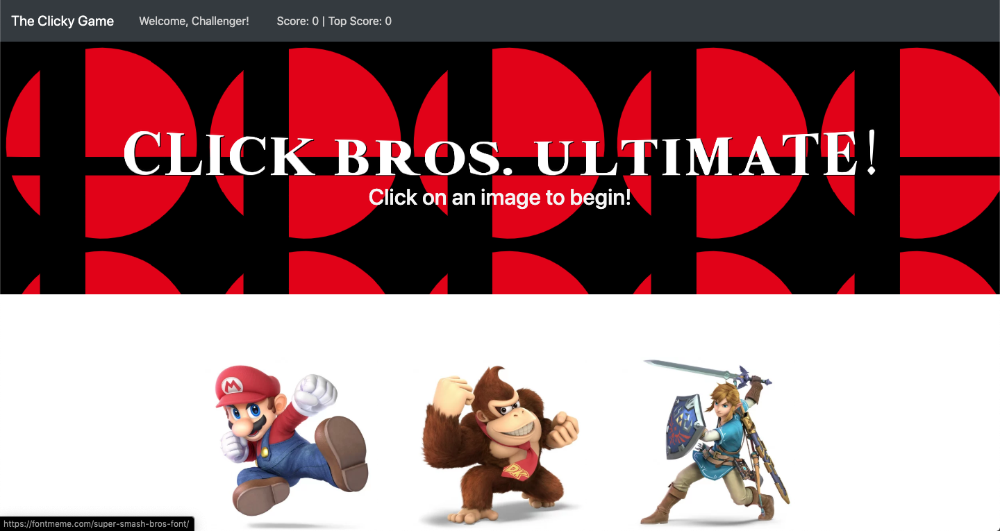
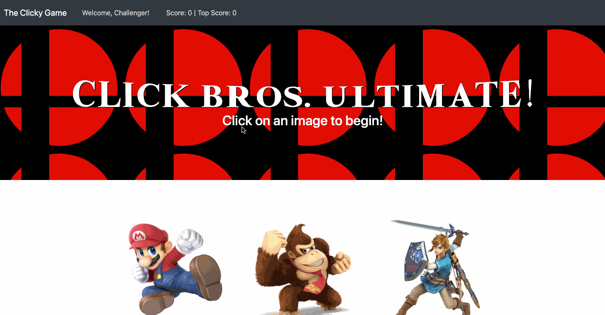

# Super Click Bros.

## Overview
Super Click Bros. is a simple clicking game with a Super Smash Bros theme. The player's goal is to click every image once. The images are stored in a .json file that is accessed as React components.

## Technologies
- React
- JSX
- HTML
- CSS
- Bootstrap

## Demo

In this demonstration, you can see that once an image has been clicked both the Score and Total Scores totals increase. The images are also randomized in order after one has been clicked. If the player clicks on an image that has already been chosen, the Score resets to zero and the player must start over again.

